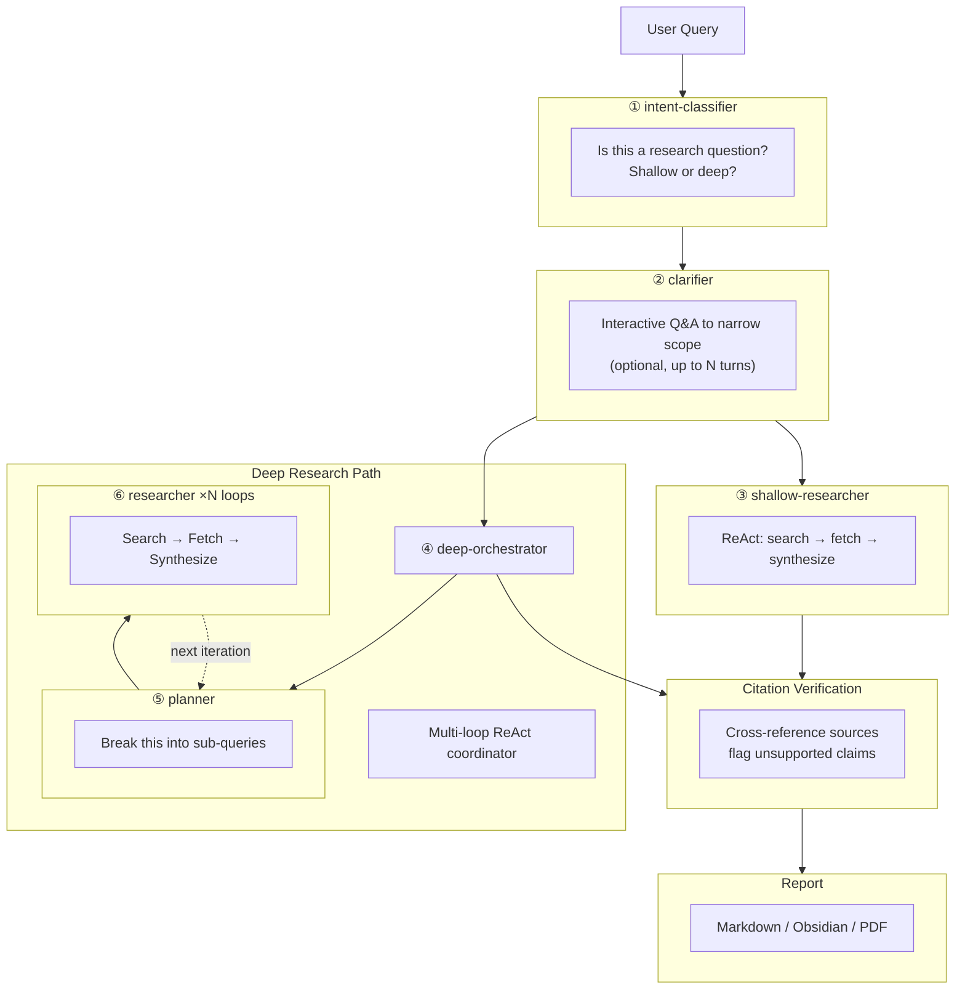

# μon

**Terminal-based deep research agent.** Ask a question, get a citation-backed research report — all from your terminal.

**Built with** [ratatui](https://ratatui.rs) + [crossterm](https://github.com/crossterm-rs/crossterm), [rig](https://github.com/0xPlaygrounds/rig), [agent_rs](https://github.com/skaarfundgandr/agent_rs) (custom ReAct agent framework), and [TurboVec](https://github.com/RyanCodrai/turbovec) (Rust vector index using Google's TurboQuant algorithm).

[](https://www.rust-lang.org/)
[](LICENSE)

## Quickstart

Install from source:

```bash
git clone https://github.com/skaarfundgandr/muon.git
cd muon
cargo build --release
```

Requires **Rust 1.87+** (edition 2024) and SQLite development libraries (`sqlite3-dev` / `libsqlite3-dev`).

Then launch the TUI:

```bash
muon
```

On first launch, μon scaffolds `~/.config/muon/config.toml` and `~/.config/muon/agents/` with defaults. Add your LLM provider API keys to the config or the TUI, and you're set.

> **Headless mode** (`muon run --headless "query"`) is experimental — it runs the full pipeline and prints the report to stdout. Export completed sessions with `muon export <session-id> <format> -o <path>` (Markdown, Obsidian, PDF).

## Features

### TUI Workspace

Five views — Welcome, Dashboard, Progress, Results, and Settings — built on ratatui + crossterm with keyboard-first navigation, mouse support, a form system, and a click-target registry. Tab or `1`–`4` to switch views.

### Multi-Provider LLM

Configure any number of LLM providers in `[[providers]]` blocks: Ollama, DeepSeek, MiniMax, or any OpenAI-compatible API. Each provider can expose multiple models. API keys support `${ENV_VAR}` expansion.

### Multi-Backend Search

Fan-out queries across all configured search providers concurrently. Bundled support for **Tavily**, **Brave**, **Firecrawl**, and **Serper** (web search) plus **arXiv** (paper search). Results are merged and deduplicated by URL.

### Pipeline State Machine

Research follows a staged pipeline: Idle → Intent Classification → Clarification (optional) → Shallow or Deep Research → Citation Verification → Complete. The pipeline runs on its own tokio task and communicates progress to the TUI via channels.

### Deep Research Loops

All agents run on the **agent_rs ReAct framework** — each with tools appropriate to its stage (search, fetch, think). The deep research path adds multi-loop orchestration: an orchestrator delegates to a planner (query decomposition) and researcher sub-agents (search → fetch → synthesize). Configurable iteration budgets, retry limits, and tool-call caps.

### Citation Verification

Every source is tracked with a reference number, title, URL, and source type. Citations are cross-referenced against the report to flag unsupported claims.

### Export

Reports export to **Markdown**, **Obsidian** notes (with vault path auto-detection), or **PDF**. Export from the TUI or via the CLI.

### RAG Knowledge Layer

Optional retrieval-augmented generation via [**TurboVec**](https://github.com/RyanCodrai/turbovec) (Google TurboQuant) + **FastEmbed** embeddings. Index past sessions and research notes for context-aware queries. Disabled by default — toggle via config.toml`[data_sources] knowledge_layer_rag` or the TUI.

### Observability

OpenTelemetry tracing with **LangSmith** integration. Debug mode preserves full span payloads. Live TUI feed shows agent progress in real time.

## Bundled Agents

μon ships with **six agents** — one for each stage of the research pipeline. Each agent is a Markdown file with YAML frontmatter (model, provider, temperature) and a system prompt body. Agents are loaded from `~/.config/muon/agents/` at startup and edited in-place via **Settings → Agents** in the TUI.



| Agent | Pipeline Stage | Role |
|-------|---------------|------|
| `intent-classifier` | Intent Classification | Classifies the query as research vs meta, shallow vs deep |
| `clarifier` | Clarification | Interactive Q&A to disambiguate scope, time horizon, format, and depth |
| `shallow-researcher` | Shallow Research | ReAct agent — searches, fetches pages, and synthesizes top-k results into a brief |
| `deep-orchestrator` | Deep Research | Multi-loop coordinator — delegates planning and research to sub-agents |
| `planner` | Deep Research (sub-agent) | Decomposes the research question into concrete search sub-queries |
| `researcher` | Deep Research (sub-agent) | Executes sub-queries via web/paper search and synthesizes findings |

Agents are configured per-stage: each can use a different model, provider, temperature, and prompt. Edits are saved with Ctrl+S in the Settings → Agents tab, which updates both the YAML frontmatter and the TOML pipeline knobs.

➡️ [`docs/agents.md`](docs/agents.md) — full agent authoring guide with frontmatter schema and template variables.

## Configuration

Two complementary systems:

### `config.toml` — providers & pipeline knobs

`~/.config/muon/config.toml` holds LLM `[[providers]]`, search `[[search.providers]]`, pipeline budgets, display preferences, and export settings. See [`examples/muon.toml`](examples/muon.toml).

### `agents/*.md` — model & prompt per stage

YAML frontmatter (`name`, `model`, `provider`, `temperature`, `max_tokens`, `timeout_secs`) + markdown prompt body. Template variables (`{{query}}`, `{{context}}`, `{{previous_findings}}`) are resolved at runtime. Agent files are the single source of truth for model/provider assignment.

## Architecture

CLEAN layered architecture (Presentation → Application → Domain → Infrastructure):

| Layer | Path | Responsibility |
|-------|------|----------------|
| **Presentation** | `src/presentation/` | ratatui TUI, 5 views, components, form system, click-target registry |
| **Application** | `src/application/` | Pipeline state machine, services, export, agent bridge |
| **Domain** | `src/domain/` | Pure models + port traits (`MuonAgent`, `SearchProvider`, `VectorStore`, `SessionStore`) |
| **Infrastructure** | `src/infrastructure/` | agent_rs ReAct wrappers, Diesel/SQLite, TurboVec RAG, search providers, config |

➡️ [`docs/backend.md`](docs/backend.md) — full architecture, storage schema, and observability details.

## Documentation

| Document | Content |
|----------|---------|
| [`docs/backend.md`](docs/backend.md) | Architecture, pipeline, storage, export, observability |
| [`docs/agents.md`](docs/agents.md) | Agent definition authoring, frontmatter schema, template variables |
| [`examples/muon.toml`](examples/muon.toml) | Complete configuration reference |
| [`examples/agents/`](examples/agents/) | Example agent definitions for all six agents |

## License

MIT — see [LICENSE](LICENSE) for details.

---

*μ (muon) — an unstable subatomic particle that penetrates deep into matter. Just like this agent penetrates deep into knowledge.*
